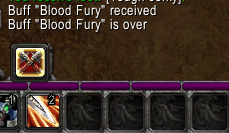
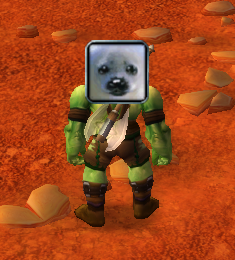
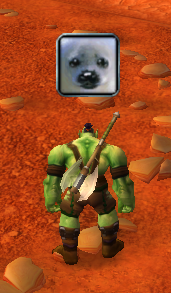
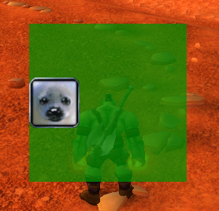
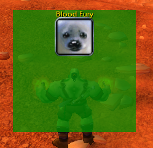
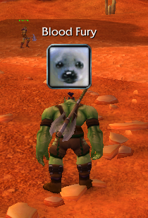
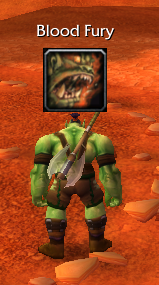
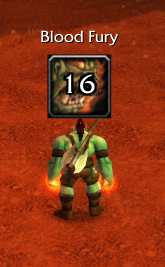

# Example 1 - Notification of received temporary boost

**I don't speak English. It's google translate. Sorry.**

---

### 1. You need to create an addon skeleton. You can read about it here:
- https://wowwiki-archive.fandom.com/wiki/Getting_started_with_writing_AddOns
- https://wowwiki-archive.fandom.com/wiki/AddOn_tutorial
- https://wowwiki-archive.fandom.com/wiki/TOC_file
- https://wowwiki-archive.fandom.com/wiki/TOC_format

As I understand it, Vanilla uses only these parameters of the TOC file:
```
## Interface: 11200
## Title: <Addon title, may not match the folder name, you can use different text colors>
## Notes: <Addon description, you can use line breaks and different text colors>
<Addon source code>.lua
```
These two parameters are also often used (but you can’t see them in the game):
```
## Author: <Author Nickname>
## Version: <Addon version number>
```

### 2. Let's start creating the addon.
Let's create a folder "Example1", inside it we will create files "Example1.toc" and "Example1.lua".

**Example1.toc:**
```
## Interface: 11200
## Title: Example1 Title
## Notes: Example1 description.
Example1.lua
```
To begin with, let's see what events take place in the game. Event names will be displayed in the game chat only for you, surrounding players do not see it. 

**Example1.lua:**
```
local f = CreateFrame('FRAME')
f:RegisterAllEvents()
f:SetScript('OnEvent', function()
    DEFAULT_CHAT_FRAME:AddMessage(event)
end)
```
You can use double quotes instead of single quotes. And use "Frame" instead of "FRAME". It doesn't matter, it's just my style.

Don't ask where the "event" variable came from. There are a large number of global variables. Which ones to use and when to use them you just need to know 🤷‍♂️ Here and now the variable "event" takes the value of the name of the event that happened.

You can read about the events here: https://wowwiki-archive.fandom.com/wiki/Event_API

### 3. Remove excess with Occam's razor

For example, we want to track the racial ability of the orcs "Blood Fury". We use this ability and see that many events have happened 🙁 I was hoping there would be only one event.

It seems to me that interesting events to consider are "UNIT_AURA" and "PLAYER_AURAS_CHANGED".<br>
According to https://wowwiki-archive.fandom.com/wiki/Events
- UNIT_AURA - Fired when a buff, debuff, status, or item bonus was gained by or faded from an entity (player, pet, NPC, or mob.)
  - arg1 - the UnitID of the entity
- PLAYER_AURAS_CHANGED - Called when a buff or debuff is either applied to a unit or is removed from the player. (Further details to follow, study needed). Also fired when you start eating and/or drinking (which really is only a buff being applied like any other).

Let's keep tracking only two events, but show the parameters of these events (arg1, etc.). In order to avoid an error, if arg is empty, there is an "or" command.

**Example1.lua:**
```
local f = CreateFrame('FRAME')
--f:RegisterAllEvents()
f:RegisterEvent('UNIT_AURA')
f:RegisterEvent('PLAYER_AURAS_CHANGED')
f:SetScript('OnEvent', function()
    DEFAULT_CHAT_FRAME:AddMessage(event)
    DEFAULT_CHAT_FRAME:AddMessage(arg1 or '')
    DEFAULT_CHAT_FRAME:AddMessage(arg2 or '')
    DEFAULT_CHAT_FRAME:AddMessage(arg3 or '')
end)
```
Let's replace the contents of the "Example1.lua" file and enter the "/run ReloadUI()" command in the game to update. And use the ability.

Unfortunately, the "PLAYER_AURAS_CHANGED" event has no parameters. The "UNIT_AURA" event has only one parameter which has the value "player". It does not give information about the received buff.

The next interesting event is "COMBAT_TEXT_UPDATE".<br>
According to https://wowwiki-archive.fandom.com/wiki/Events
- COMBAT_TEXT_UPDATE - Fired when the currently watched entity (as set by the CombatTextSetActiveUnit function) takes or avoids damage, receives heals, gains mana/energy/rage, etc. This event is used by Blizzard's floating combat text addon.
  - arg1 - Combat message type. Known values include "DAMAGE", "SPELL_DAMAGE", "DAMAGE_CRIT", "HEAL", "PERIODIC_HEAL", "HEAL_CRIT", "MISS", "DODGE", "PARRY", "BLOCK", "RESIST", "SPELL_RESISTED", "ABSORB", "SPELL_ABSORBED", "MANA", "ENERGY", "RAGE", "FOCUS", "SPELL_ACTIVE", "COMBO_POINTS", "AURA_START", "AURA_END", "AURA_START_HARMFUL", "AURA_END_HARMFUL", "HONOR_GAINED", and "FACTION".
  - arg2 - For damage, power gain and honor gains, this is the amount taken/gained. For heals, this is the healer name. For auras, the aura name. For block/resist/absorb messages where arg3 is not nil (indicating a partial block/resist/absorb) this is the amount taken. For faction gain, this is the faction name. For the SPELL_ACTIVE message, the name of the spell (abilities like Overpower and Riposte becoming active will trigger this message).
  - arg3 - For heals, the amount healed. For block/resist/absorb messages, this is the amount blocked/resisted/absorbed, or nil if all damage was avoided. For faction gain, the amount of reputation gained.

**Example1.lua:**
```
local f = CreateFrame('FRAME')
--f:RegisterAllEvents()
f:RegisterEvent('COMBAT_TEXT_UPDATE')
f:SetScript('OnEvent', function()
    DEFAULT_CHAT_FRAME:AddMessage(event)
    DEFAULT_CHAT_FRAME:AddMessage(arg1 or '')
    DEFAULT_CHAT_FRAME:AddMessage(arg2 or '')
    DEFAULT_CHAT_FRAME:AddMessage(arg3 or '')
end)
```
Let's replace the contents of the "Example1.lua" file and enter the "/run ReloadUI()" command in the game to update. And use the ability.

We use the ability and see messages in the chat:
- COMBAT_TEXT_UPDATE
- AURA_START
- Blood Fury

And:
- COMBAT_TEXT_UPDATE
- AURA_END
- Blood Fury

### 4. Functionality
Thus, we can already get information about when the buff started and when it ended. Implement the display of this information in the chat.

**Example1.lua:**
```
local f = CreateFrame('FRAME')
f:RegisterEvent('COMBAT_TEXT_UPDATE')
f:SetScript('OnEvent', function()
    if arg2 == 'Blood Fury' then
        if arg1 == 'AURA_START' then
            DEFAULT_CHAT_FRAME:AddMessage('Buff "Blood Fury" received')
        elseif arg1 == 'AURA_END' then
            DEFAULT_CHAT_FRAME:AddMessage('Buff "Blood Fury" is over')
        end
    end
end)
```
Let's replace the contents of the "Example1.lua" file and enter the "/run ReloadUI()" command in the game to update. And use the ability. In the chat we see:



*It took approximately 1 hour 40 minutes to write the guide to this point.*

---

### 5. User Interface
Writing functional code is logical and straightforward: we receive events and call functions. Writing a user interface is not like that. Blizzard programmers and developers of old addons wrote the user interface in separate xml files. It sounds logical: to separate the code from the interface. How it's done in [WPF](https://en.wikipedia.org/wiki/Windows_Presentation_Foundation) and [QML](https://en.wikipedia.org/wiki/QML). But in practice, the community of addon creators at some point in time (perhaps expansion WotLK) decided that the best practice would be to write a user interface in the LUA language. You can look at the writing of the user interface from Blizzard programmers [here](https://www.townlong-yak.com/framexml/1.12.1). I prefer a modern and more flexible and functional option - writing an interface in the LUA language. But even on the LUA there is no single correct guideline.

For example, you can create a local frame variable: `local f = CreateFrame('FRAME')` or a global variable `f = CreateFrame('FRAME')`. You can also create a global variable like this: `CreateFrame('FRAME', 'f')`. Even the simplest action - but there is no longer a single solution. And I've seen a lot of bad code in addons like: `local LocalVariable = CreateFrame('FRAME', 'GlobalVariable')` or `GlobalVariable = CreateFrame('FRAME', 'GlobalVariable')`.

The problem with global variables is that they must be unique. If another addon uses the same global variable name, then your addon will ruin its work (or it will ruin your addon's work). Do you think that the solution to this problem is to use local variables? Nope 🤦‍♂️ If you want the player to be able to move your frame around the screen and the game remembers its position - you MUST make it global 🤷‍♂️ Also you should use only global variables for: [EditBox](https://wowwiki-archive.fandom.com/wiki/UIOBJECT_EditBox), [CheckButton](https://wowwiki-archive.fandom.com/wiki/UIOBJECT_CheckButton), [DropDown and Context menus](https://wowwiki-archive.fandom.com/wiki/Using_UIDropDownMenu).

So our task is to display the texture of the buff on the screen. And again, this can be done in many ways. Way #1 - use a [UIParent](https://www.townlong-yak.com/framexml/1.12.1/UIParent.xml) frame, which is essentially the parent frame of the entire screen. Way #2 - use your own frame. It seems to me that it will be more convenient to position and add new features to your frame.

---

Let's display one of the game icons in the center of the screen.

**Way #1 - Example1.lua:**
```
local f = CreateFrame('FRAME')
f:RegisterEvent('COMBAT_TEXT_UPDATE')
f:SetScript('OnEvent', function()
    if arg2 == 'Blood Fury' then
        if arg1 == 'AURA_START' then
            DEFAULT_CHAT_FRAME:AddMessage('Buff "Blood Fury" received')
        elseif arg1 == 'AURA_END' then
            DEFAULT_CHAT_FRAME:AddMessage('Buff "Blood Fury" is over')
        end
    end
end)

local t = UIParent:CreateTexture(nil, 'ARTWORK')
t:SetTexture('Interface\\Icons\\Ability_Seal')
t:SetPoint('CENTER', UIParent)
t:SetWidth(64)
t:SetHeight(64)
```
You can read here:
- https://wowwiki-archive.fandom.com/wiki/API_Frame_CreateTexture
- https://wowwiki-archive.fandom.com/wiki/XML/Layer

You may see `SetPoint('CENTER')` in various documentations and articles, but this does not work in Vanilla. There must always be more than one parameter. The second parameter can be an indication of which relative frame to apply centering: `SetPoint('CENTER', UIParent)`. Or the second (and third) parameter can be an offset relative to the parent frame: `SetPoint('CENTER', 0, 0)`.

Both code `t:SetPoint('CENTER', UIParent)` and code `t:SetPoint('CENTER', 0, 0)` give the following result:



Move the texture of the icon higher so that it does not block the character.

**Way #1 - Example1.lua:**
```
local f = CreateFrame('FRAME')
f:RegisterEvent('COMBAT_TEXT_UPDATE')
f:SetScript('OnEvent', function()
    if arg2 == 'Blood Fury' then
        if arg1 == 'AURA_START' then
            DEFAULT_CHAT_FRAME:AddMessage('Buff "Blood Fury" received')
        elseif arg1 == 'AURA_END' then
            DEFAULT_CHAT_FRAME:AddMessage('Buff "Blood Fury" is over')
        end
    end
end)

local t = UIParent:CreateTexture(nil, 'ARTWORK')
t:SetTexture('Interface\\Icons\\Ability_Seal')
t:SetPoint('CENTER', UIParent, 0, 70) -- or t:SetPoint('CENTER', 0, 70)
t:SetWidth(64)
t:SetHeight(64)
```


Now let's make it so that this texture is displayed only during the "Blood Fury" ability.

**Way #1 - Example1.lua:**
```
local t = UIParent:CreateTexture(nil, 'ARTWORK')
t:SetTexture('Interface\\Icons\\Ability_Seal')
t:SetPoint('CENTER', UIParent, 0, 70) -- or t:SetPoint('CENTER', 0, 70)
t:SetWidth(64)
t:SetHeight(64)
t:Hide()

local f = CreateFrame('FRAME')
f:RegisterEvent('COMBAT_TEXT_UPDATE')
f:SetScript('OnEvent', function()
    if arg2 == 'Blood Fury' then
        if arg1 == 'AURA_START' then
            DEFAULT_CHAT_FRAME:AddMessage('Buff "Blood Fury" received')
            t:Show()
        elseif arg1 == 'AURA_END' then
            DEFAULT_CHAT_FRAME:AddMessage('Buff "Blood Fury" is over')
            t:Hide()
        end
    end
end)
```
The variable `t` must be moved higher in the code, otherwise an error occurs when accessing a non-existent variable.

Now we have the desired result.<br>
<This should be a video, not a screenshot>

---

Way #2 is a bit more complicated and requires writing more code, but in my opinion it is more functional for future features.

First, let's create a frame that will contain the texture. We already have a frame for tracking events, we use it.

**Way #2 - Example1.lua:**
```
local f = CreateFrame('FRAME')
f:SetBackdrop({bgFile = 'Interface\\Tooltips\\UI-Tooltip-Background'}) -- this is temporary, just for show
f:SetBackdropColor(0, 1, 0, 1) -- this is temporary, just for show
f:SetPoint('CENTER', UIParent)
f:SetWidth(200)
f:SetHeight(200)
f:RegisterEvent('COMBAT_TEXT_UPDATE')
f:SetScript('OnEvent', function()
    if arg2 == 'Blood Fury' then
        if arg1 == 'AURA_START' then
            DEFAULT_CHAT_FRAME:AddMessage('Buff "Blood Fury" received')
        elseif arg1 == 'AURA_END' then
            DEFAULT_CHAT_FRAME:AddMessage('Buff "Blood Fury" is over')
        end
    end
end)
```


Now let's add the texture of the icon as a child element. In this example, the texture will be the variable `texture` included in the table `frame`.

**Way #2 - Example1.lua:**
```
local frame = CreateFrame('FRAME')
frame:SetBackdrop({bgFile = 'Interface\\Tooltips\\UI-Tooltip-Background'}) -- this is temporary, just for show
frame:SetBackdropColor(0, 1, 0, 1) -- this is temporary, just for show
frame:SetPoint('CENTER', UIParent)
frame:SetWidth(200)
frame:SetHeight(200)
frame:RegisterEvent('COMBAT_TEXT_UPDATE')
frame:SetScript('OnEvent', function()
    if arg2 == 'Blood Fury' then
        if arg1 == 'AURA_START' then
            DEFAULT_CHAT_FRAME:AddMessage('Buff "Blood Fury" received')
            frame.texture:Show()
        elseif arg1 == 'AURA_END' then
            DEFAULT_CHAT_FRAME:AddMessage('Buff "Blood Fury" is over')
            frame.texture:Hide()
        end
    end
end)

frame.texture = frame:CreateTexture(nil, 'ARTWORK')
frame.texture:SetTexture('Interface\\Icons\\Ability_Seal')
frame.texture:SetPoint('TOP', frame, 'TOP')
frame.texture:SetWidth(64)
frame.texture:SetHeight(64)
frame.texture:Hide()
```


But this can be done in various ways, for example: `frame:CreateTexture('GlobalTexture', 'ARTWORK')`.

**About positioning:**<br>
`SetPoint('TOP', frame, 'TOP')` means: push the top of the texture to the top of the frame `frame`.

For example, if we want the left side of the texture to be pressed against the left side of the frame: `SetPoint('LEFT', frame, 'LEFT')`



We can move the texture outside of the frame.<br>
Push the left side of the texture to the right side of the frame and to the top: `SetPoint('TOPLEFT', frame, 'TOPRIGHT')`


If the sides are the same (for example, push the top of the texture to the top of the frame), then the third parameter can be omitted.

*It took me about 2 hours to write this paragraph.*

---

### 6. Adding functionality

For example, you can add the ability to display as text. The following code is used to create a line of text.
```
frame.title = frame:CreateFontString(nil, 'OVERLAY', 'GameFontNormal')
frame.title:SetPoint('TOP', frame, 'TOP')
frame.title:SetText('Blood Fury')
```
The name of the ability will be placed at the top of the frame, and the texture of the icon will be placed below this line.
```
frame.texture:SetPoint('TOP', frame.title, 'BOTTOM')
```
Full code:
```
local frame = CreateFrame('FRAME')
frame:SetBackdrop({bgFile = 'Interface\\Tooltips\\UI-Tooltip-Background'}) -- this is temporary, just for show
frame:SetBackdropColor(0, 1, 0, 1) -- this is temporary, just for show
frame:SetPoint('CENTER', UIParent)
frame:SetWidth(200)
frame:SetHeight(200)
frame:RegisterEvent('COMBAT_TEXT_UPDATE')
frame:SetScript('OnEvent', function()
    if arg2 == 'Blood Fury' then
        if arg1 == 'AURA_START' then
            DEFAULT_CHAT_FRAME:AddMessage('Buff "Blood Fury" received')
            frame.texture:Show()
            frame.title:Show()
        elseif arg1 == 'AURA_END' then
            DEFAULT_CHAT_FRAME:AddMessage('Buff "Blood Fury" is over')
            frame.texture:Hide()
            frame.title:Hide()
        end
    end
end)

frame.title = frame:CreateFontString(nil, 'OVERLAY', 'GameFontNormal')
frame.title:SetPoint('TOP', frame, 'TOP')
frame.title:SetText('Blood Fury')
frame.title:Hide()

frame.texture = frame:CreateTexture(nil, 'ARTWORK')
frame.texture:SetTexture('Interface\\Icons\\Ability_Seal')
frame.texture:SetPoint('TOP', frame.title, 'BOTTOM')
frame.texture:SetWidth(64)
frame.texture:SetHeight(64)
frame.texture:Hide()
```


To make it more beautiful, you can increase the indent between the line and the texture:
```
frame.texture:SetPoint('TOP', frame.title, 'BOTTOM', 0, -10)
```
And increase the text size and choose white color:
```
frame.title = frame:CreateFontString(nil, 'OVERLAY', 'GameFontHighlightLarge')
```
Types of strings that are used in the game: https://www.townlong-yak.com/framexml/1.12.1/Fonts.xml<br>
And remove the green background from the frame. Now it looks like this:



Now we would like to use not a random icon, but an ability icon.

Let's see the contents of the file: https://www.townlong-yak.com/framexml/1.12.1/SpellBookFrame.lua<br>
We will meet a call to the `GetSpellTabInfo` function. Let's try to get data using this function:
```
local res = {GetSpellTabInfo(1)}
DEFAULT_CHAT_FRAME:AddMessage(res[1] or '')
DEFAULT_CHAT_FRAME:AddMessage(res[2] or '')
DEFAULT_CHAT_FRAME:AddMessage(res[3] or '')
```
We got the name and icon of the first spell tab in the spell book, not the name and icon of the first spell.<br>
Next, we see the call to the `GetSpellName` function. Let's try to get data using this function:
```
local res = {GetSpellName(1, BOOKTYPE_SPELL)}
DEFAULT_CHAT_FRAME:AddMessage(res[1] or '')
DEFAULT_CHAT_FRAME:AddMessage(res[2] or '')
DEFAULT_CHAT_FRAME:AddMessage(res[3] or '')
```
We got the name of the first spell in the spell book. Next, it is logical to check the function `GetSpellTexture`:
```
local res = {GetSpellTexture(1, BOOKTYPE_SPELL)}
DEFAULT_CHAT_FRAME:AddMessage(res[1] or '')
DEFAULT_CHAT_FRAME:AddMessage(res[2] or '')
DEFAULT_CHAT_FRAME:AddMessage(res[3] or '')
```
We now have the texture of the first spell icon in the spellbook. But the spell we need has a different number, and when new spells are received, this number can change. Therefore, it is necessary to dynamically find the spell we need.<br>
We know that the spell we need is on the first tab of the spell book. We need to get the number of spells on this tab. Let's try it:
```
local _, _, _, spellCount = GetSpellTabInfo(1)
DEFAULT_CHAT_FRAME:AddMessage(spellCount)
```
Yes, this is what we need.

In almost all addons, you can see such a function call if some first parameters are not needed. But you can get the desired parameter in this way:
```
local spellCount = ({GetSpellTabInfo(1)})[4]
```
Now we just have to implement the search function for the desired texture.
```
function GetTex()
    local spellCount = ({GetSpellTabInfo(1)})[4]
    for i = 1, spellCount do
        if GetSpellName(i, BOOKTYPE_SPELL) == 'Blood Fury' then
            return GetSpellTexture(i, BOOKTYPE_SPELL)
        end
    end
    return 'Interface\\Icons\\Ability_Seal'
end
```
This is done as a function to make it more convenient to handle the situation in which the texture was not found and the default texture should be used.

Full code:
```
function GetTex()
    local spellCount = ({GetSpellTabInfo(1)})[4]
    for i = 1, spellCount do
        if GetSpellName(i, BOOKTYPE_SPELL) == 'Blood Fury' then
            return GetSpellTexture(i, BOOKTYPE_SPELL)
        end
    end
    return 'Interface\\Icons\\Ability_Seal'
end

local frame = CreateFrame('FRAME')
frame:SetPoint('CENTER', UIParent)
frame:SetWidth(200)
frame:SetHeight(200)
frame:RegisterEvent('COMBAT_TEXT_UPDATE')
frame:SetScript('OnEvent', function()
    if arg2 == 'Blood Fury' then
        if arg1 == 'AURA_START' then
            DEFAULT_CHAT_FRAME:AddMessage('Buff "Blood Fury" received')
                frame.texture:Show()
                frame.title:Show()
        elseif arg1 == 'AURA_END' then
            DEFAULT_CHAT_FRAME:AddMessage('Buff "Blood Fury" is over')
                frame.texture:Hide()
                frame.title:Hide()
        end
    end
end)

frame.title = frame:CreateFontString(nil, 'OVERLAY', 'GameFontHighlightLarge')
frame.title:SetPoint('TOP', frame, 'TOP')
frame.title:SetText('Blood Fury')
frame.title:Hide()

frame.texture = frame:CreateTexture(nil, 'ARTWORK')
frame.texture:SetTexture(GetTex())
frame.texture:SetPoint('TOP', frame.title, 'BOTTOM', 0, -10)
frame.texture:SetWidth(64)
frame.texture:SetHeight(64)
frame.texture:Hide()
```


*It took me about 1 hour to write this paragraph.*

***I dealt with many functions for the first time and indicated the approximate time to show that it takes not so much time to figure it out.***

---

### 7. Display countdown

I finally finished working on the timer implementation. Vanilla doesn't have a "Timer" or "Stopwatch" component out of the box. The implementation of the timer is my code, as the idea is based on [this code](https://www.townlong-yak.com/framexml/1.12.1/Cooldown.lua).

Full code:
```
function GetTex()
    local spellCount = ({GetSpellTabInfo(1)})[4]
    for i = 1, spellCount do
        if GetSpellName(i, BOOKTYPE_SPELL) == 'Blood Fury' then
            return GetSpellTexture(i, BOOKTYPE_SPELL)
        end
    end
    return 'Interface\\Icons\\Ability_Seal'
end

local frame = CreateFrame('FRAME')
frame:SetPoint('CENTER', UIParent)
frame:SetWidth(200)
frame:SetHeight(200)
frame:RegisterEvent('COMBAT_TEXT_UPDATE')
frame:SetScript('OnEvent', function()
    if arg2 == 'Blood Fury' then
        if arg1 == 'AURA_START' then
            DEFAULT_CHAT_FRAME:AddMessage('Buff "Blood Fury" received')
            frame.texture:Show()
            frame.title:Show()
            ShowTimer(20, frame.timer)
        elseif arg1 == 'AURA_END' then
            DEFAULT_CHAT_FRAME:AddMessage('Buff "Blood Fury" is over')
            frame.texture:Hide()
            frame.title:Hide()
        end
    end
end)

frame.title = frame:CreateFontString(nil, 'OVERLAY', 'GameFontHighlightLarge')
frame.title:SetPoint('TOP', frame, 'TOP')
frame.title:SetText('Blood Fury')
frame.title:Hide()

frame.texture = frame:CreateTexture(nil, 'ARTWORK')
frame.texture:SetTexture(GetTex())
frame.texture:SetPoint('TOP', frame.title, 'BOTTOM', 0, -10)
frame.texture:SetWidth(64)
frame.texture:SetHeight(64)
frame.texture:Hide()

frame.timer = frame:CreateFontString(nil, 'OVERLAY', 'SubZoneTextFont')
frame.timer:SetPoint('CENTER', frame.texture)

function ShowTimer(duration, string)
    local timer = CreateFrame('FRAME')
    timer.start = GetTime()
    timer.duration = duration
    timer.sec = 0
    timer:SetScript('OnUpdate', function()
        if GetTime() >= (this.start + this.sec) then
            this.sec = this.sec + 1
            if this.sec <= duration then
                string:SetText(this.duration - this.sec)
                return
            end
            string:Hide()
            this:SetScript('OnUpdate', nil)
        end
    end)
    string:SetText(duration)
    string:Show()
end
```


---

### 8. Bug fixes


